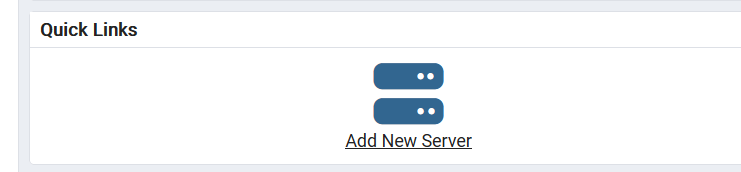
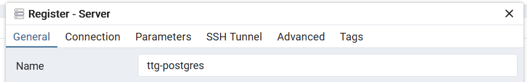
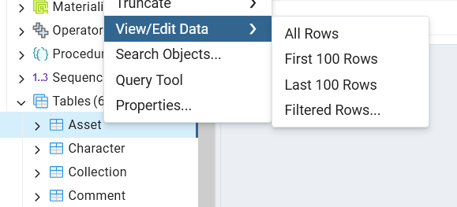

# Contributing

## Prerequisites

- [NVM](https://github.com/nvm-sh/nvm)
- [Node.js v22.x 'Jod' (LTS)](https://nodejs.org/en)
- [Git](https://git-scm.com/)
- [Docker](https://www.docker.com/)
- [Visual Studio Code](https://code.visualstudio.com/)

## Setup

- `git clone <url>`: Clone the project to your workspace

- `nvm install`: Install and use the correct version of Node.js for the project

- `npm i`: Install required packages using npm

- `npx prisma generate`: Generate the Prisma ORM Client

- Enable these VSCode extensions in the project workspace:

  - [Code Spell Checker](https://marketplace.visualstudio.com/items?itemName=streetsidesoftware.code-spell-checker)
  - [ESLint](https://marketplace.visualstudio.com/items?itemName=dbaeumer.vscode-eslint)
  - [Hurl](https://marketplace.visualstudio.com/items?itemName=JacobPfeifer.pfeifer-hurl)
  - [npm Intellisense](https://marketplace.visualstudio.com/items?itemName=christian-kohler.npm-intellisense)
  - [Prettier](https://marketplace.visualstudio.com/items?itemName=esbenp.prettier-vscode)
  - [Prisma](https://marketplace.visualstudio.com/items?itemName=Prisma.prisma)

## Development

The recommended setup for development is running the server on the host machine and running services in Docker Compose. You will need:

- [Groq API key](https://console.groq.com/)
- [Groq text generation model name](https://console.groq.com/docs/models) (the default is`gemma2-9b-it`)
- [Cloudflare Workers AI API key](https://developers.cloudflare.com/workers-ai/)
- [Cloudflare Workers AI text-to-image model name](https://developers.cloudflare.com/workers-ai/models/) (the default is `@cf/stabilityai/stable-diffusion-xl-base-1.0`)
- [Cloudflare AI Gateway token](https://developers.cloudflare.com/ai-gateway/)
- Cloudflare AI Gateway name

```bash
# Create a .env file with development presets
cp .env.example .env

# Start MinIO, create the default bucket, and start Postgres and pgAdmin
docker compose up mc pgadmin # -d to detach i.e. run in background

# Run server and restart on changes to source code
npm run dev
```

### Credentials

For development and integration testing, we use HTTP Basic Auth. We have two default users:

```txt
user1@email.com:password1
user2@email.com:password2
```

### Using the Visual Studio Code Debugger

You can also use the Visual Studio Code debugger instead of `npm run dev`:

1. Click Run and Debug:


2. Click "Launch via NPM":


### Using MinIO and the MinIO Console in Docker Compose

You can use the Docker Compose MinIO service as the S3 endpoint for object storage in development. The MinIO console will let you interact with MinIO using a GUI and can be accessed at `localhost:9001` when the MinIO Docker service is running. The default MinIO credentials are `minio-username` and `minio-password`.

### Using Postgres in Docker Compose

You can use the Docker Compose Postgres service as the Postgres database for development. There are two ways to interact with it using a GUI:

#### With Prisma Studio

While the Postgres database Docker Compose service is running, you can use Prisma Studio with `npx prisma studio` to view and edit data in the database.


#### With pgAdmin

While the Postgres and pgAdmin Docker Compose services are running, you can access pgAdmin at `localhost:5050` to interact with the Postgres service using a GUI. The default pgAdmin credentials are `postgres@email.com` and `mypassword`. Once in pgAdmin, you can connect to the Postgres service:

1. Click on "Add New Server":



2. Enter a name:



3. Click on Connection and enter the hostname/address `postgres` and the password `mypassword`. Then click the Save button:


4. You should see the postgres server and tables in the Object Explorer on the left:


5. You can then view/edit data or perform other operations on the tables:



### Re-initializing the Database

If the database initialization script (`docker/postgres/initdb/initdb.sql`) on the `main` branch has changed since you initialized your local Postgres database (the last time you ran `docker compose up`), you need to re-initialize your local database and re-generate your Prisma client.

Remove the Postgres and pgAdmin containers, remove their Docker volumes, and restart the services. The database will be re-initialized from the new initialization script. Next, re-generate the Prisma client.

```bash
# Remove the Postgres services
docker compose rm postgres pgadmin

# Remove persistent storage for the Postgres services
docker volume rm ttg-server_postgres_data ttg-server_pgadmin_data

# Restart the Postgres services and re-initialize the database
docker compose up pgadmin

# Update your Prisma client with the new schema
npx prisma generate
```

### Updating the Database Initialization Script

If you update the database initialization script (`docker/postgres/initdb/initdb.sql`), you need to follow almost the same steps as [Re-initializing the Database](#re-initializing-the-database), but you also need to update the Prisma schema before re-generating your client:

```
# Remove the Postgres services
docker compose rm postgres pgadmin

# Remove persistent storage for the Postgres services
docker volume rm ttg-server_postgres_data ttg-server_pgadmin_data

# Restart the Postgres services and re-initialize the database
docker compose up pgadmin

# Inspect the database and update the Prisma schema
npx prisma db pull

# Update your Prisma client with the new schema
npx prisma generate
```

## Testing

### Integration Tests in CI

During CI, the server runs in Docker Compose, meaning signed URLs will have the S3 endpoint's Docker internal hostname (`http://minio:9000`). This must be accounted for in integration tests.

## Scripts

These scripts are located in `package.json` and can be run using `npm run <script>`.

### Running

- `start`: Starts the server.
- `dev`: Runs a development server which reloads on changes to the source code.
- `debug`: Used to attach the VSCode Debugger. Not intended for manual use.

### Testing

- `test`: Runs all unit tests. Pass globs for test files you want to run as arguments.
- `test:watch`: Run unit tests and watch for changes to related files.
- `test:coverage`: Runs all unit tests and generates a code coverage report, found in `coverage/lcov-report/index.html`.
- `test:integration`: Runs all integration tests. The server must be running on `http://localhost:8080` with HTTP Basic Auth.

### Linting & Formatting

- `lint`: Runs [ESLint](https://eslint.org/) on all files in the project directory.
- `prettier`: Runs [Prettier](https://prettier.io/) on all files in the project directory.

## Workflow

Please follow the [GitHub flow](https://docs.github.com/en/get-started/using-github/github-flow) for contributions:

1. **Update your local main branch**

   Switch to your main branch and pull the latest changes from the remote repository:

   ```bash
   git switch main
   git pull --prune
   ```

- The `--prune` option removes any references to branches that no longer exist on the remote.

2. **Create a new branch**

   Name your branch following the convention `issue-number` (e.g., `issue-1`):

   ```bash
   git switch -c <issue-number> main
   ```

   - If no issue exists for the change you are making, please [create one](https://github.com/tabletop-generator/ttg-server/issues/new/choose).

3. **Make your changes**

   Start the development server:

   ```bash
   npm run dev
   ```

   - If introducing new code, add tests for your changes.

4. **Test your changes**

   Run the following checks to ensure everything works as expected:

   ```bash
   npm run lint
   npm run test
   docker compose up -d
   npm run test:integration # Server must be running, so run "docker compose up" first
   ```

5. **Review your changes**

   Check which files have been changed:

   ```bash
   git status
   ```

6. **Stage your changes**

   Add the relevant files to staging:

   ```bash
   git add <files>
   ```

7. **Commit your changes**

   Write a meaningful commit message:

   ```bash
   git commit -m "<commit message>"
   ```

8. **Push your branch**

   Push your changes and set the upstream branch:

   ```bash
   git push -u origin <your-branch-name>
   ```

9. **Create a pull request**

   [Create a pull request](https://github.com/tabletop-generator/ttg-server/compare) on GitHub. Fill in the template and link it to the issue using:

   ```txt
   Fixes #[issue number]
   ```

## Documentation

- **Language:** [JavaScript](https://developer.mozilla.org/en-US/docs/Web/JavaScript)
- **Containerization:** [Docker](https://docs.docker.com/reference/)
- **Server:** [Express](https://expressjs.com/en/4x/api.html)
  - **Logging:** [Pino](https://getpino.io/#/docs/api), [pino-pretty](https://github.com/pinojs/pino-pretty)
  - **Security:** [Helmet](https://helmetjs.github.io/), [Express/CORS](https://github.com/expressjs/cors#readme)
  - **Graceful Shutdown:** [Stoppable](https://github.com/hunterloftis/stoppable#readme)
  - **Rate Limiting:** [express-rate-limit](https://express-rate-limit.mintlify.app/)
- **Storage:**
  - **Production:** TBD
  - **Local:** [Postgres](https://www.postgresql.org/), [MinIO](https://min.io/)
- **Authorization:**
  - [Passport.js](https://www.passportjs.org/)
  - **Production:** [Amazon Cognito](https://aws.amazon.com/cognito/), [aws-jwt-verify](https://github.com/awslabs/aws-jwt-verify#readme), [passport-http-bearer](https://www.passportjs.org/packages/passport-http-bearer/)
  - **Local:** [http-auth](https://www.npmjs.com/package/http-auth), [http-auth-passport](https://www.npmjs.com/package/http-auth-passport)
- **Testing:**
  - **Unit Testing:** [Jest](https://jestjs.io/), [Supertest](https://github.com/ladjs/supertest#readme)
  - **Integration Testing:** [Hurl](https://hurl.dev/), [Docker Compose](https://docs.docker.com/compose/)
- **Runtime:** [Node.js](https://nodejs.org/docs/latest-v22.x/api/)
- **Runners:** [nodemon](https://github.com/remy/nodemon#readme)
- **Package Manager:** [npm](https://docs.npmjs.com/)
- **Version Control System:** [Git](https://git-scm.com/doc), [GitHub](https://docs.github.com/)
- **CI/CD:** [GitHub Actions](https://docs.github.com/en/actions)
- **Linting:** [ESLint](https://eslint.org/docs/v9.x/)
- **Formatting:** [Prettier](https://prettier.io/docs/en/)
- **Git Hooks:**
  - [Husky](https://typicode.github.io/husky/)
  - [lint-staged](https://github.com/lint-staged/lint-staged)
