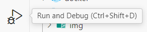
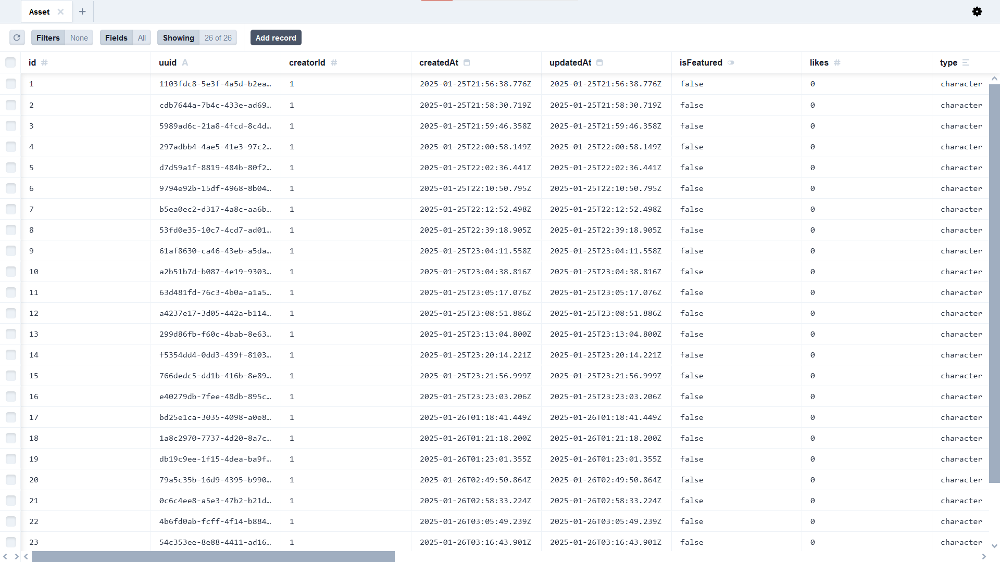

# Contributing

## Prerequisites

- [nvm](https://github.com/nvm-sh/nvm) or [fnm](https://github.com/Schniz/fnm)
- [Node.js v22.x 'Jod' (LTS)](https://nodejs.org/en)
- [Git](https://git-scm.com/)
- [Docker](https://www.docker.com/)
- [Visual Studio Code](https://code.visualstudio.com/)

## Setup

You will need to provide the following environment variables:

- [Groq API key](https://console.groq.com/)
- [Groq text generation model name](https://console.groq.com/docs/models) (the default is`gemma2-9b-it`)
- [Cloudflare Workers AI API key](https://developers.cloudflare.com/workers-ai/)
- [Cloudflare Workers AI text-to-image model name](https://developers.cloudflare.com/workers-ai/models/) (the default is `@cf/stabilityai/stable-diffusion-xl-base-1.0`)
- [Cloudflare AI Gateway token](https://developers.cloudflare.com/ai-gateway/)
- [Cloudflare AI Gateway name](https://developers.cloudflare.com/ai-gateway/)

1. Clone the project to your workspace.

   ```bash
   git clone <url> ttg-server
   cd ttg-server
   ```

2. Create a .env file with development presets. Then enter your own environment variables from the links above.

   ```bash
   cp .env.example .env
   ```

3. Install and use the project's supported Node.js version.

   With nvm:

   ```bash
   nvm install
   ```

   With fnm:

   ```bash
   fnm install
   ```

4. Install dependencies.

   ```bash
   npm install
   ```

5. Generate Prisma Client

   ```bash
   npx prisma generate
   ```

6. Start backing services with Docker.

   ```bash
   docker compose up # -d to detach i.e. run in background
   ```

   This starts MinIO, creates the default bucket, and starts Postgres. Wait for the services to finish starting, it takes a while before they're ready.

7. Start the server on `localhost:8080` (or whatever `PORT` environment variable you specified)

   ```bash
   npm run start
   ```

## Development

### Authorization

#### HTTP Basic Auth Default Credentials

For development and integration testing, we use HTTP Basic Auth. We have two default users that exist in the database:

```txt
user1@email.com:password1
user2@email.com:password2
```

#### Bearer Token Authentication

For testing with Bearer Token authentication, you will need to get a Bearer Token from the configured Amazon Cognito user pool. You can do this using [ttg-client](https://github.com/tabletop-generator/ttg-client) by signing in and checking your browser's Session Storage for `id_token`. Once you have the token, you can make authenticated requests by putting the token in the Authorization header: `Authorization: Bearer [token]`.

You will need to add the email you used to sign in to the local development database. You need a SHA256 hashed value of the email. You can get this in two ways:

- **Using the Node.js REPL:** Run the following commands.

  ```bash
  node
  # Welcome to Node.js v22.13.0.
  # Type ".help" for more information.

  const crypto = require("node:crypto");
  # undefined

  crypto.createHash("sha256").update("user1@email.com").digest("hex");
  # '11d4c22e42c8f61feaba154683dea407b101cfd90987dda9e342843263ca420a'
  ```

- **From Debug Logs:** Run the server with the environment variable `LOG_LEVEL=debug` and send a request to an auth-protected endpoint. You should see a log message saying "Authenticated user" with the hashed email beside it.

Once you have your hashed email, you will need to add this to your local Docker Compose Postgres database. You can do this by sending a request to `POST /v1/users/:id` (where `:id` is your hashed email), or you can do it with Prisma Studio. See [Using Postgres in Docker Compose](#using-postgres-in-docker-compose).

### Using the Visual Studio Code Debugger

You can also use the Visual Studio Code debugger instead of `npm run dev`:

1. Click Run and Debug:

   

2. Click "Launch via NPM":

   

### Using MinIO and the MinIO Console in Docker Compose

You can use the Docker Compose MinIO service as the S3 endpoint for object storage in development. The MinIO console will let you interact with MinIO using a GUI and can be accessed at `localhost:9001` when the MinIO Docker service is running. The default MinIO credentials are `minio-username` and `minio-password`.

### Using Postgres in Docker Compose

You can use the Docker Compose Postgres service as the Postgres database for development.

While the Postgres database Docker Compose service is running, you can use Prisma Studio with `npx prisma studio` to view and edit data in the database.



### Re-initializing the Database

If the database initialization script (`docker/postgres/initdb/initdb.sql`) on the `main` branch has changed since you initialized your local Postgres database (the last time you ran `docker compose up`), you need to re-initialize your local database and re-generate your Prisma client.

Remove the backing services and their volumes, and restart them. The database will be re-initialized from the new initialization script. Next, re-generate the Prisma client.

```bash
# Remove backing services and volumes
docker compose down -v

# Restart services and re-initialize the database
docker compose up [-d]

# Update your Prisma client with the new schema
npx prisma generate
```

### Updating the Database Initialization Script

If you update the database initialization script (`docker/postgres/initdb/initdb.sql`), you need to follow almost the same steps as [Re-initializing the Database](#re-initializing-the-database), but you also need to update the Prisma schema before re-generating your client:

```bash
# Remove backing services and volumes
docker compose down -v

# Restart services and re-initialize the database
docker compose up [-d]

# Inspect the database and update the Prisma schema
npx prisma db pull

# Update your Prisma client with the new schema
npx prisma generate
```

## Testing

### Integration Testing

> [!NOTE]
> During integration testing, the server will run in Docker Compose, meaning signed URLs will have the S3 endpoint's Docker internal hostname (`http://minio:9000`). This must be accounted for in integration tests.

For integration testing, use `compose.integration.yaml`. This Compose file doesn't persist data in volumes.

```bash
docker compose -f compose.integration.yaml up --build

npm run test:integration

docker compose -f compose.integration.yaml down
```

## Scripts

These scripts are located in `package.json` and can be run using `npm run <script>`.

### Run Scripts

- `start`: Starts the server.
- `dev`: Runs a development server which reloads on changes to the source code.
- `debug`: Used to attach the VSCode Debugger. Not intended for manual use.

### Test Scripts

- `test`: Runs all unit tests. Pass globs for test files you want to run as arguments.
- `test:watch`: Run unit tests and watch for changes to related files.
- `test:coverage`: Runs all unit tests and generates a code coverage report, found in `coverage/lcov-report/index.html`.
- `test:integration`: Runs all integration tests. The server must be running on `http://localhost:8080` with HTTP Basic Auth.

### Linting & Formatting

- `lint`: Runs [ESLint](https://eslint.org/) on all files in the project directory.
- `prettier`: Runs [Prettier](https://prettier.io/) on all files in the project directory.

## Workflow

Please follow the [GitHub flow](https://docs.github.com/en/get-started/using-github/github-flow) for contributions:

1. **Update your local main branch**

   ```bash
   git switch main
   git pull --prune
   ```

   Switch to your main branch and pull the latest changes from the remote repository. The `--prune` option removes any references to branches that no longer exist on the remote.

2. **Create a new branch from main**

   ```bash
   git switch -c <issue-number> main
   ```

   Name your branch following the convention `issue-number` (e.g., `issue-1`). If no issue exists for the change you are making, you should [create one](https://github.com/tabletop-generator/ttg-server/issues/new), unless the change is really quick or small.

3. **Make your changes, commit, and push**

   You should commit your changes as you're making them. Commit often - smaller commits are generally better. Ideally, each commit contains an isolated, complete change. This makes it easy to revert your changes if you decide to take a different approach. Avoid cosmetic changes to unrelated files in the same commit. If introducing new code, add tests for your changes.

   i. **Review your changes:** Check which files have been changed.

   ```bash
   git status
   ```

   ii. **Stage your changes:** Add the relevant files to the index.

   ```bash
   git add <files>
   ```

   iii. **Commit your changes:** Give each commit a descriptive message to help you and future contributors understand what changes the commit contains.

   ```bash
   git commit -m "<commit message>"
   ```

   iv. **Push your branch:** Push your changes and set the upstream branch.

   ```bash
   git push -u origin <your-branch-name>
   ```

   After you do this for the first time for your branch, your branch now exists on the remote repository, and commits can be pushed with `git push`.

   v. **Create a draft pull request:** [Create a draft pull request](https://github.com/tabletop-generator/ttg-server/compare) on GitHub to let others know you're working on the issue and to request feedback on your work as you're working on it. Link your pull request to the issue using [closing keywords](https://docs.github.com/en/issues/tracking-your-work-with-issues/using-issues/linking-a-pull-request-to-an-issue#linking-a-pull-request-to-an-issue-using-a-keyword):

   ```txt
   Fixes #[issue number]
   ```

   vi. Continue making changes, committing them, and pushing them until your changes are ready for review.

4. **Mark your pull request ready for review**

   Once your changes are ready for review, in the merge box, click Ready for review.

   

5. **For maintainers: remember to squash and merge**

   Squash and merge pull requests to keep a clean commit history on the main branch.

## Resources

- [Using Pull Requests](https://docs.github.com/en/free-pro-team@latest/github/collaborating-with-issues-and-pull-requests/about-pull-requests)
- [GitHub Docs](https://docs.github.com/)

## Documentation

- **Language:** [JavaScript](https://developer.mozilla.org/en-US/docs/Web/JavaScript)
- **Server:** [Express](https://expressjs.com/en/4x/api.html)
  - **Logging:** [Pino](https://getpino.io/#/docs/api), [pino-pretty](https://github.com/pinojs/pino-pretty)
  - **Security:** [Helmet](https://helmetjs.github.io/), [Express/CORS](https://github.com/expressjs/cors#readme)
  - **Graceful Shutdown:** [Stoppable](https://github.com/hunterloftis/stoppable#readme)
  - **Rate Limiting:** [express-rate-limit](https://express-rate-limit.mintlify.app/)
- **Storage:** [Prisma](https://www.prisma.io/docs), [AWS SDK for JavaScript S3 Client](https://www.npmjs.com/package/@aws-sdk/client-s3)
- **Authorization:** [Passport.js](https://www.passportjs.org/)
  - **Production:** [aws-jwt-verify](https://github.com/awslabs/aws-jwt-verify#readme), [passport-http-bearer](https://www.passportjs.org/packages/passport-http-bearer/)
  - **Local:** [http-auth](https://www.npmjs.com/package/http-auth), [http-auth-passport](https://www.npmjs.com/package/http-auth-passport)
- **Testing:**
  - **Unit Testing:** [Jest](https://jestjs.io/), [Supertest](https://github.com/ladjs/supertest#readme)
  - **Integration Testing:** [Hurl](https://hurl.dev/)
- **Containerization:** [Docker](https://docs.docker.com/reference/)
- **Local Backing Services:** [Docker Compose](https://docs.docker.com/compose/), [Postgres Docker Image](https://hub.docker.com/_/postgres), [MinIO Docker Image](https://hub.docker.com/r/minio/minio)
- **Runtime:** [Node.js](https://nodejs.org/docs/latest-v22.x/api/)
- **Runners:** [nodemon](https://github.com/remy/nodemon#readme)
- **Package Manager:** [npm](https://docs.npmjs.com/)
- **Version Control System:** [Git](https://git-scm.com/doc), [GitHub](https://docs.github.com/)
- **CI/CD:** [GitHub Actions](https://docs.github.com/en/actions)
- **Linting:** [ESLint](https://eslint.org/docs/v9.x/)
- **Formatting:** [Prettier](https://prettier.io/docs/en/)
- **Git Hooks:**
  - [Husky](https://typicode.github.io/husky/)
  - [lint-staged](https://github.com/lint-staged/lint-staged)
